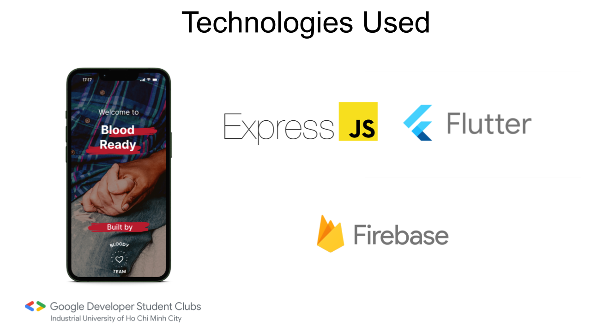

# Bloody - GDSC Solution Challenge 2023

## Getting Started

Bloody is a blood donation app that displays blood events created by hospitals or blood donation centers. Users can register for these events and donate blood through the app.

## 17 SDGs

Bloody is a intended to solve Goal 3: Good Health and Well-Being of the United Nations Sustainable Development Goals.

## Problem Statement

The shortage of blood is a serious problem in Vietnam, especially after the COVID-19 pandemic. And the pandemic has made it even harder to find blood donors. The pandemic has caused a lot of blood donation events to be canceled. This has led to a shortage of blood in hospitals and blood donation centers.

## Features

- Users can register and login to the app.
- Users can view blood events (regular and emergency).
- Users can register for blood events.
- Users can view their registered events.
- Users can view their profile.

## Demo

## Tech Stack

The app is built using the following technologies:



## Our app name

We chose the name Bloody because it is short and easy to remember. It's combination of the words blood and ready.

## Team

Our team comes from the [Google Developer Student Clubs](https://developers.google.com/community/dsc) at Industrial University of Ho Chi Minh City.

- [Nguyen Xuan Long]()
- [Nguyen Duc Chien]()
- [Hoa Xuan Sang]()
- [Phong Dang Ngoc]()

## Architecture

### Backend

Our backend is a REST API written in Node.js. It uses the Express framework and is connected to Firestore.

The backend is located in the `server` directory.

From the root of the project, cd into the backend directory:

```bash
cd server
```

To run the backend locally, you need to install the dependencies with:

```bash
yarn install
```
> Note: You need to have Node.js and Yarn installed on your machine.

Then, you can run the backend with:

```bash
yarn start
```

The backend will be running on `http://localhost:8000`.

Unfortunately, the backend is running locally and cannot be accessed from the frontend. To solve this, we use [ngrok](https://ngrok.com/). Ngrok allows us to expose our local server to the internet.

To run ngrok, you need to install it first. You can find the instructions [here](https://ngrok.com/download).

Once you have ngrok installed, you can start tunneling your local server which runs on port 8000 with:

```bash
ngrok http 8000
```

After running this command, you will see a URL that looks like this: `http://<random_string>.ngrok.io`. This is the URL that you need to use in the frontend.

### Frontend

Our frontend is a Flutter app. To run it, first you need to install Flutter development tools. You can find the instructions [here](https://flutter.dev/docs/get-started/install).

The frontend is located in the `app` directory.

From the root of the project, cd into the frontend directory:

```bash
cd app
```
Now, install the dependencies with:

```bash
flutter pub get
```

After that, you need to update the `baseUrl` in `lib/services/api_service.dart` to the URL that you got from ngrok.

```dart
  final String baseUrl = "<replace_with_ngrok_url>";
```

Then, you can run the app with:

```bash
flutter run lib/main.dart
```